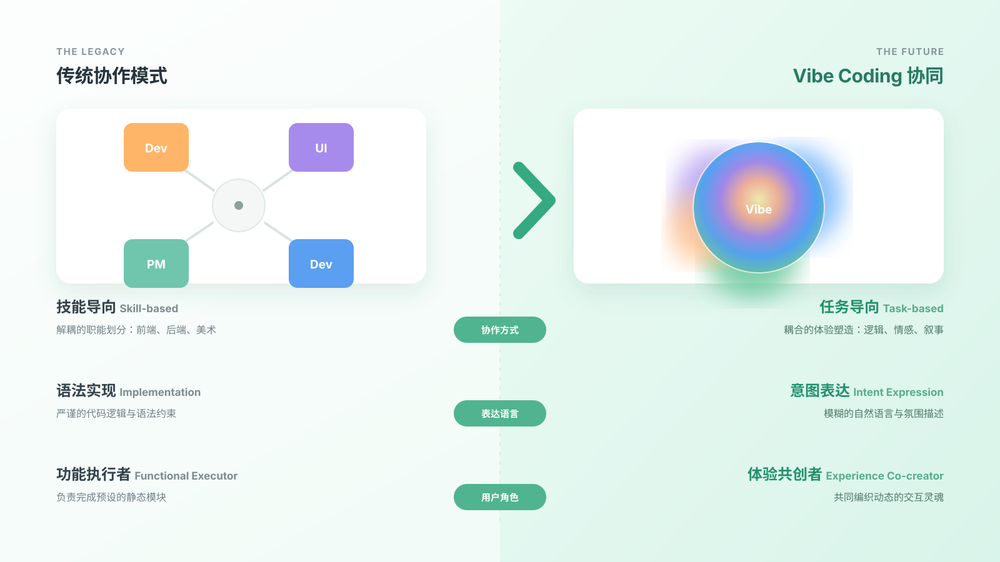

# CODELAB v1.0.1

多人实时协作的游戏共创工具，支持五种工作模式，让策划、设计、开发在同一个房间里一起干活。

**在线体验：** [https://xueimy.github.io/CODELAB/](https://xueimy.github.io/CODELAB/)



## 五种模式

| 模式 | 功能 |
|------|------|
| 🎮 游戏模式 | 全屏游戏预览，带浮动聊天和排行榜 |
| 👥 共创模式 | 在线成员列表、贡献统计、AI 助手、实时游戏预览 |
| 💬 规划模式 | 团队聊天、备忘录、任务清单 |
| 🎨 设计模式 | 响应式预览（桌面/平板/手机）、设计笔记、配色工具 |
| ⌨ 开发模式 | 代码编辑器 + 实时预览，双栏布局 |

## 快速开始

1. 安装 **Node.js 18+**
2. 把 `.env.example` 复制为 `.env`，填入 API Key
3. 房主电脑运行：
   ```bash
   npm install
   npm start
   ```
4. 打开启动日志里的本机地址（默认 `http://localhost:3000`）
5. 同一局域网内的其他人直接访问日志里的 `LAN access` 地址加入房间

## 局域网联机

- 只需要一台电脑作为房主启动服务
- 其他协作者和房主在同一局域网，打开房主地址即可加入
- 远程光标、代码同步、聊天和任务清单都走同一个房间同步通道

## 环境变量

```env
ANTHROPIC_API_KEY=sk-你的密钥
ANTHROPIC_API_BASE=https://api.moonshot.ai/v1
PORT=3000
```

## 项目背景

CODELAB 是为独立游戏团队和 Game Jam 场景设计的协作工具。传统开发工具把策划、设计、开发割裂在不同的软件里，CODELAB 把它们放在一个房间，实时同步。

---

© 2026 CODELAB
