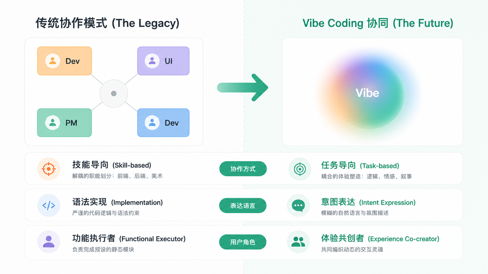
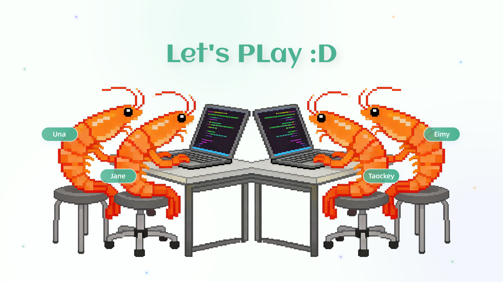
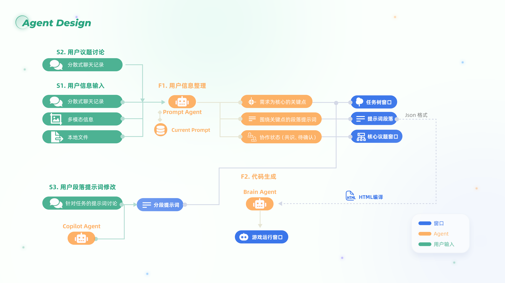
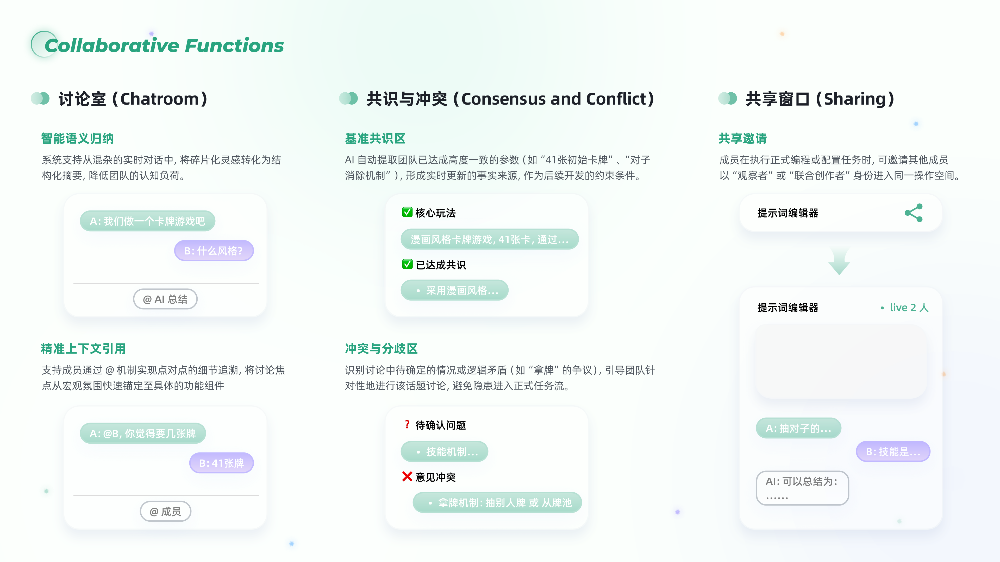
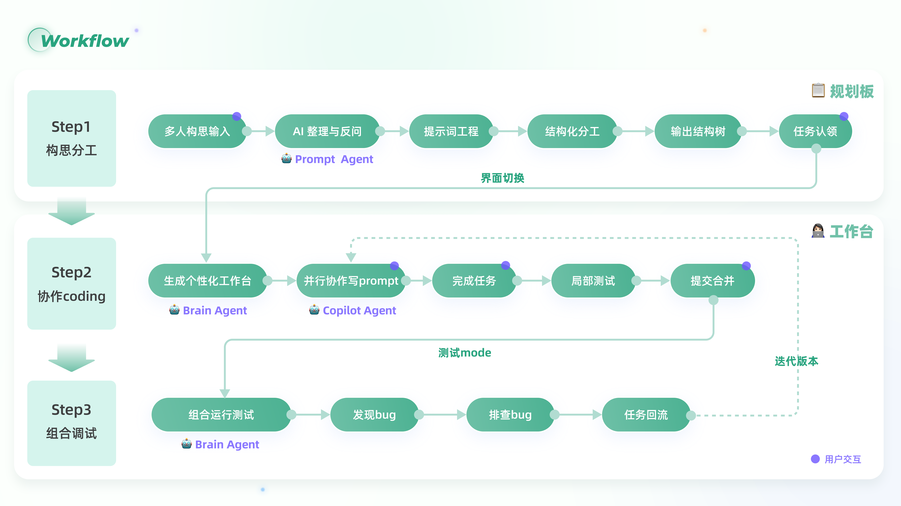
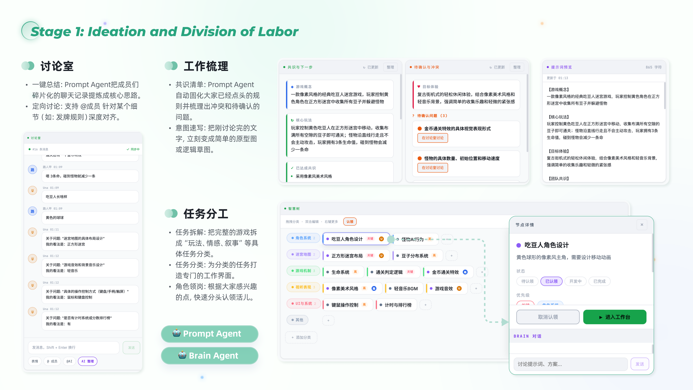
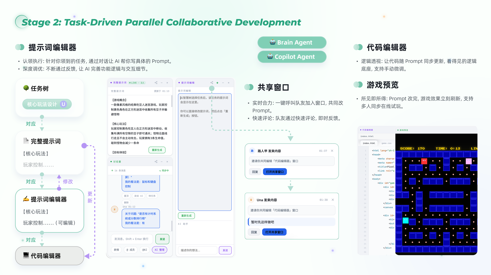
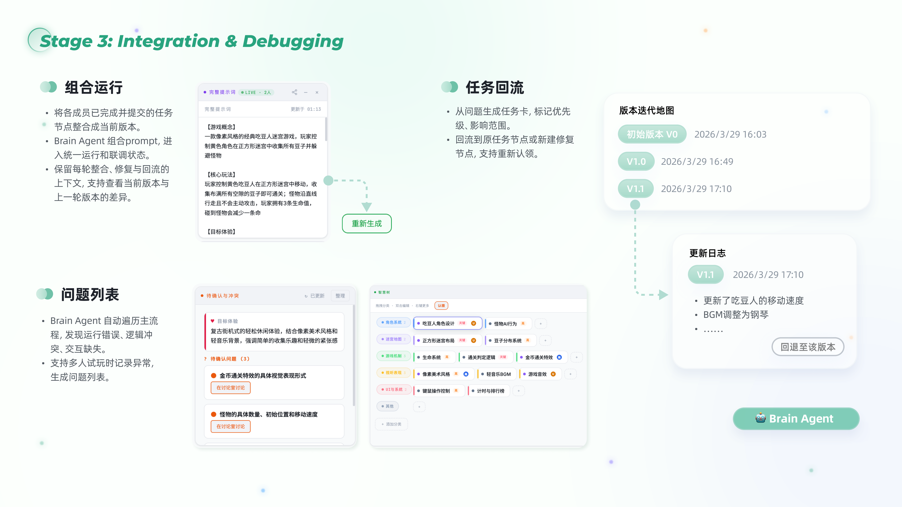

# CODELAB

> 为独立游戏团队和 Game Jam 打造的实时协作共创平台。

[在线体验](https://xueimy.github.io/CODELAB/) · [本地运行](#本地运行) · [局域网协作](#局域网协作)

CODELAB 让策划、设计与开发围绕同一个游戏体验实时协作：一起讨论、拆分任务、编辑代码、预览结果，并同步每一次变化。



## 产品展示

### 在线演示

在同一个工作台中完成讨论、设计、开发与实时预览。



### 系统设计

从共享工作区到协作状态，CODELAB 将创作过程中的关键上下文放在同一个空间里。





## 工作流

先对齐游戏意图，再将任务拆分、协作完成并在同一处验证结果。



<details>
<summary>查看完整的三步工作流</summary>

<br>







</details>

## 本地运行

需要 Node.js 18 或更高版本。

```bash
npm install
npm start
```

启动后，打开终端输出的本机地址（默认 `http://localhost:3000`）。

## 配置

如需使用 AI 功能，在项目根目录创建 `.env` 并填写所用服务的配置：

```env
ANTHROPIC_API_KEY=your-api-key
ANTHROPIC_API_BASE=https://api.moonshot.ai/v1
PORT=3000
```

## 局域网协作

1. 由一位成员在电脑上启动 CODELAB。
2. 其他成员连接同一局域网。
3. 打开终端输出中的 `LAN access` 地址加入房间。

远程光标、代码同步、聊天和任务清单会在同一协作房间内实时更新。

## 项目背景

传统工具往往把策划、设计与开发分散在不同地方。CODELAB 尝试把它们放进同一个共享工作区，让团队能围绕游戏体验快速沟通、共同构建并即时验证。

---

© 2026 CODELAB
